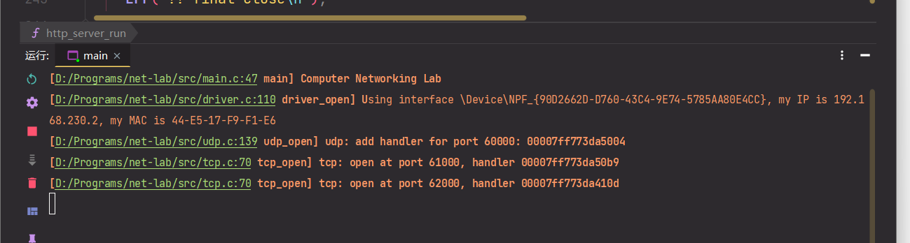
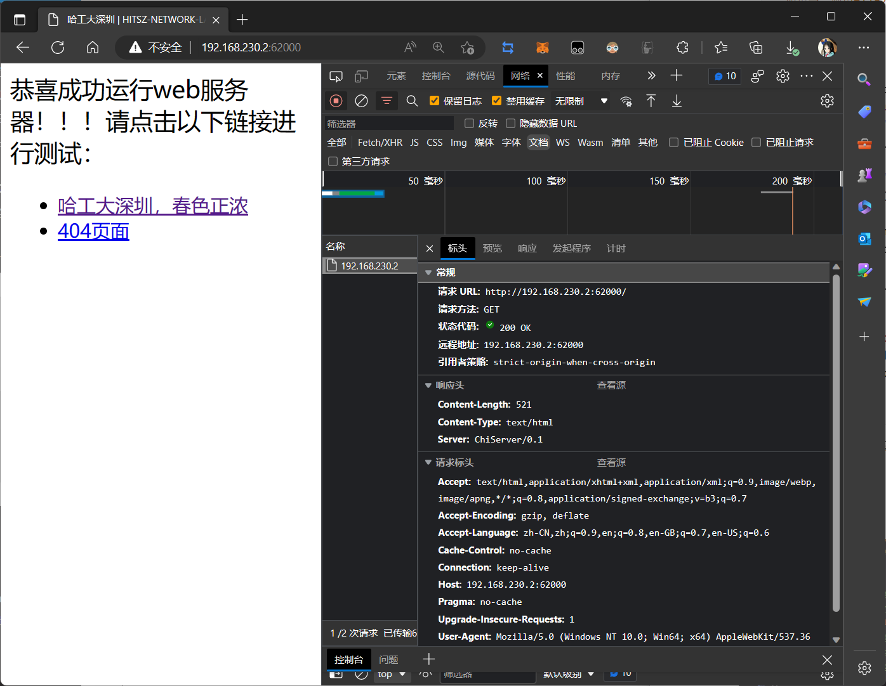
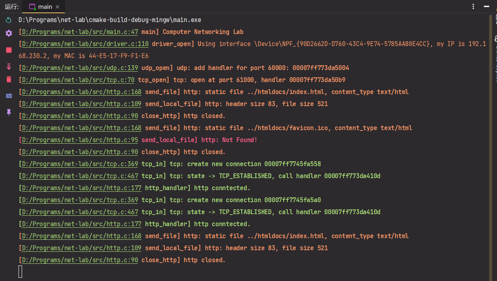
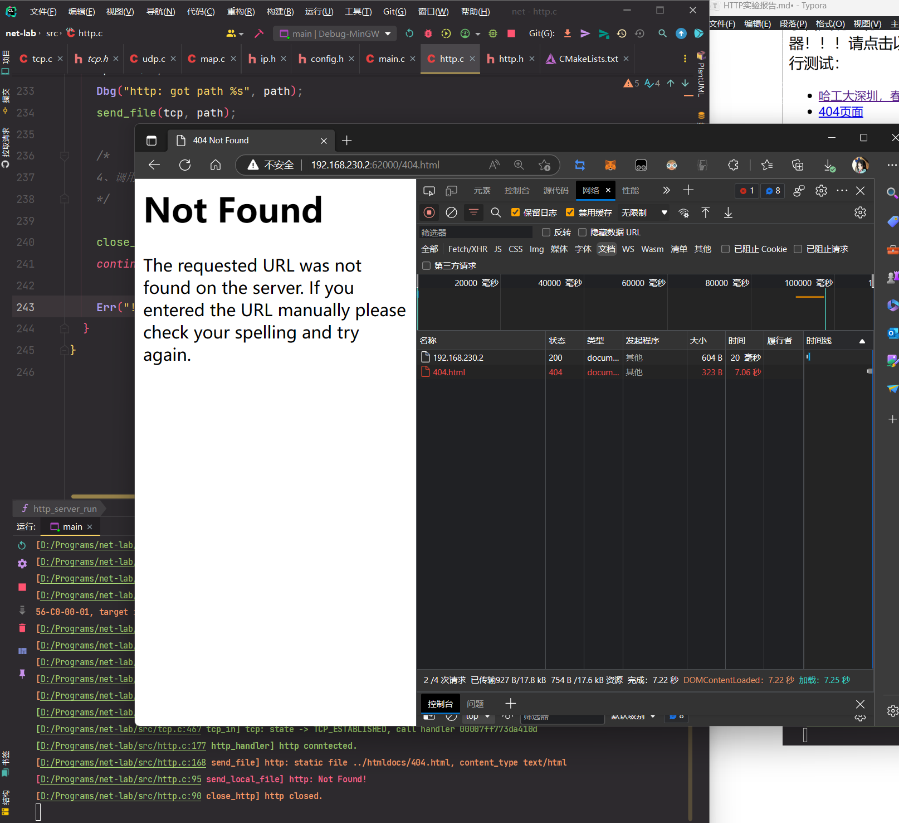
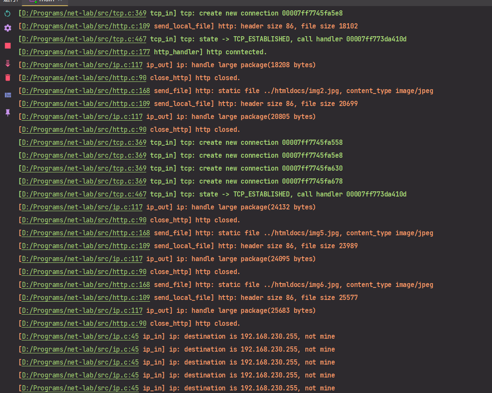

## HTTP 实验报告

### 实验详细设计

实验中在实验所给定的框架的基础上，完成了一个简单的基于 TCP 的 HTTP 服务器。

1. `http_send` 设计

   直接循环调用 `tcp_connect_write` 直到所有数据写入完成。

   ```c
   static size_t http_send(tcp_connect_t *tcp, const char *buf, size_t size) {
     size_t send = 0;
     while (send < size) {
       send += tcp_connect_write(tcp, (const uint8_t *) buf + send, size - send);
       net_poll();
       Dbg("http: write %zu, target size=%zu", send, size);
     }
     return send;
   }
   ```

2. `send_local_file` 设计

   发送 HTTP 头，并循环读取一个 `tx_buffer` 大小的数据块，调用 `http_send` 将数据发送出去。

   ```c
   static bool send_local_file(tcp_connect_t *tcp, FILE *f, const char *content_type) {
     if (!f) {
       Err("http: Not Found!");
       return false;
     }
     char tx_buffer[1024];
     fseek(f, 0, SEEK_END);
     size_t filesize = ftell(f);
     fseek(f, 0, SEEK_SET);
     sprintf(tx_buffer, "HTTP/1.1 200 OK\n"
                        "Content-Length: %zu\n"
                        "Content-Type: %s\n"
                        "Server: ChiServer/0.1\n\n", filesize, content_type);
     size_t len = strlen(tx_buffer);
     Assert(http_send(tcp, tx_buffer, len) == len, "Cannot write http headers!");
     size_t sz;
     Log("http: header size %zu, file size %zu", len, filesize);
     do {
       // sz = fread(tx_buffer + len, 1, sizeof(tx_buffer) - len, f);
       // if (sz) http_send(tcp, tx_buffer, sz + len);
       sz = fread(tx_buffer, 1, sizeof(tx_buffer), f);
       Dbg("http: read static file for %zu bytes", sz);
       if (sz) http_send(tcp, tx_buffer, sz);
     } while (sz);
     return true;
   }
   ```

3. `send_file` 设计

   检查文件系统，如果是合法的文件请求则调用 `send_local_file` 将文件发送出去，否则返回 404 页面。

   ```c
   static void send_file(tcp_connect_t *tcp, const char *url) {
     // FILE *file;
     // uint32_t size;
     const char *static_path = XHTTP_DOC_DIR;
     char file_path[255];
     const char content_404[] = "HTTP/1.1 404 NOT FOUND\n"
                                "Content-Type: text/html\n"
                                "Content-Length: 233\n"
                                "Server: ChiServer/0.1\n"
                                "\n"
                                "<!DOCTYPE HTML PUBLIC \"-//W3C//DTD HTML 3.2 Final//EN\">\n"
                                "<title>404 Not Found</title>\n"
                                "<h1>Not Found</h1>\n"
                                "<p>The requested URL was not found on the server.  If you entered the URL manually please check your spelling and try again.</p>";
   
     /*
     解析url路径，查看是否是查看XHTTP_DOC_DIR目录下的文件
     如果不是，则发送404 NOT FOUND
     如果是，则用HTTP/1.0协议发送
   
     注意，本实验的WEB服务器网页存放在XHTTP_DOC_DIR目录中
     */
   
     char *content_type = "text/html";
     if (!*url) return;
     if (*url == '/' && *(url + 1) == '\0') {
       sprintf(file_path, "%s/%s", static_path, "index.html");
     } else {
       if (*url == '/') sprintf(file_path, "%s/%s", static_path, url + 1);
       else sprintf(file_path, "%s/%s", static_path, url);
     }
     FILE *f = fopen(file_path, "rb");
     if (str_endswith(file_path, ".jpg")) {
       content_type = "image/jpeg";
     } else if (str_endswith(file_path, ".css")) {
       content_type = "text/css";
     }
     Log("http: static file %s, content_type %s", file_path, content_type);
     if (!send_local_file(tcp, f, content_type)) {
       http_send(tcp, content_404, sizeof(content_404));
     }
   }
   ```

其他代码基本与框架一致没有变动。

### HTTP 与 TCP 的交互分析

1. 创建服务器，并初始化 HTTP FIFO 队列。

   ```c
   // 在端口上创建服务器。
   
   int http_server_open(uint16_t port) {
     if (!tcp_open(port, http_handler)) {
       return -1;
     }
     http_fifo_init(&http_fifo_v);
     return 0;
   }
   ```

   其中，`http_handler` 是一个 TCP 处理函数，当收到 TCP 包后会将这个包交给监听了这个 `port ` 的处理函数，也就是 `http_handler`。

   ```c
   static void http_handler(tcp_connect_t *tcp, connect_state_t state) {
     if (state == TCP_CONN_CONNECTED) {
       http_fifo_in(&http_fifo_v, tcp);
       Ok("http conntected.");
     } else if (state == TCP_CONN_DATA_RECV) {
     } else if (state == TCP_CONN_CLOSED) {
       Log("http closed.");
     } else {
       assert(0);
     }
   }
   ```

   在处理函数中判断当前连接的类型，并只处理 `TCP_CONN_CONNECTED`。

2. 从 FIFO 中取得请求并处理。FIFO 中的元素是 Connection，即以连接为单位进行请求。

   其中还需要处理路径解析逻辑和 method 判断，即从 HTTP 头中解析出请求的 url path，并屏蔽除了 GET 外的所有请求。

   ```c
   // 从FIFO取出请求并处理。新的HTTP请求时会发送到FIFO中等待处理。
   
   void http_server_run(void) {
     tcp_connect_t *tcp;
     char rx_buffer[1024];
   
     while ((tcp = http_fifo_out(&http_fifo_v)) != NULL) {
       /*
       1、调用get_line从rx_buffer中获取一行数据，如果没有数据，则调用close_http关闭tcp，并继续循环
       */
   
       if (get_line(tcp, rx_buffer, sizeof(rx_buffer)) == 0) {
         close_http(tcp);
         continue;
       }
       Dbg("http: first line %s", rx_buffer);
   
       /*
       2、检查是否有GET请求，如果没有，则调用close_http关闭tcp，并继续循环
       */
   
       char *p = strstr(rx_buffer, "GET");
       if (p == NULL) {
         close_http(tcp);
         continue;
       }
   
       /*
       3、解析GET请求的路径，注意跳过空格，找到GET请求的文件，调用send_file发送文件
       */
   
       p += 3;
       while (*p && *p == ' ') p++;
       char *path = p;
       while (*p && *p != ' ') p++;
       *p = '\0';
       Dbg("http: got path %s", path);
       send_file(tcp, path);
   
       /*
       4、调用close_http关掉连接
       */
   
       close_http(tcp);
       continue;
   
       Err("!! final close\n");
     }
   }
   ```

3. HTTP 发送：见上 `http_send`，其中调用了 `tcp_connect_write`，将指定数据发送到指定的连接。

   还调用了 `net_poll`，用于触发新的一次协议栈轮询，以便在发送过程中接收新的数据。

   ```c
   /**
    * @brief 往connect的tx_buf里面写东西，返回成功的字节数，这里要判断窗口够不够，否则图片显示不全。
    *        供应用层使用
    *
    * @param connect
    * @param data
    * @param len
    */
   size_t tcp_connect_write(tcp_connect_t *connect, const uint8_t *data, size_t len) {
     // printf("tcp_connect_write size: %zu\n", len);
     buf_t *tx_buf = connect->tx_buf;
   
     uint8_t *dst = tx_buf->data + tx_buf->len;
     size_t size = min32(&tx_buf->payload[BUF_MAX_LEN] - dst, len);
   
     if (connect->next_seq - connect->unack_seq + len >= connect->remote_win) {
       return 0;
     }
     if (buf_add_padding(tx_buf, size) != 0) {
       memmove(tx_buf->payload, tx_buf->data, tx_buf->len);
       tx_buf->data = tx_buf->payload;
       if (tcp_write_to_buf(connect, &txbuf)) {
         tcp_send(&txbuf, connect, tcp_flags_ack);
       }
       return 0;
     }
     memcpy(dst, data, size);
     return size;
   }
   ```

   

### 实验结果

程序开始运行：



浏览器访问主页



有个找不到的文件是 `favicon.ico`，即网站图标



测试 404 页面：



测试含有图片的页面，以及图片数据的传输：




### 存在的问题

由于 TCP 层没有处理丢包重发，所以连接有可能会卡死，而浏览器默认使用 HTTP/1.1，会复用连接，所以刷新浏览器可能也无法重新连接，需要重启程序。