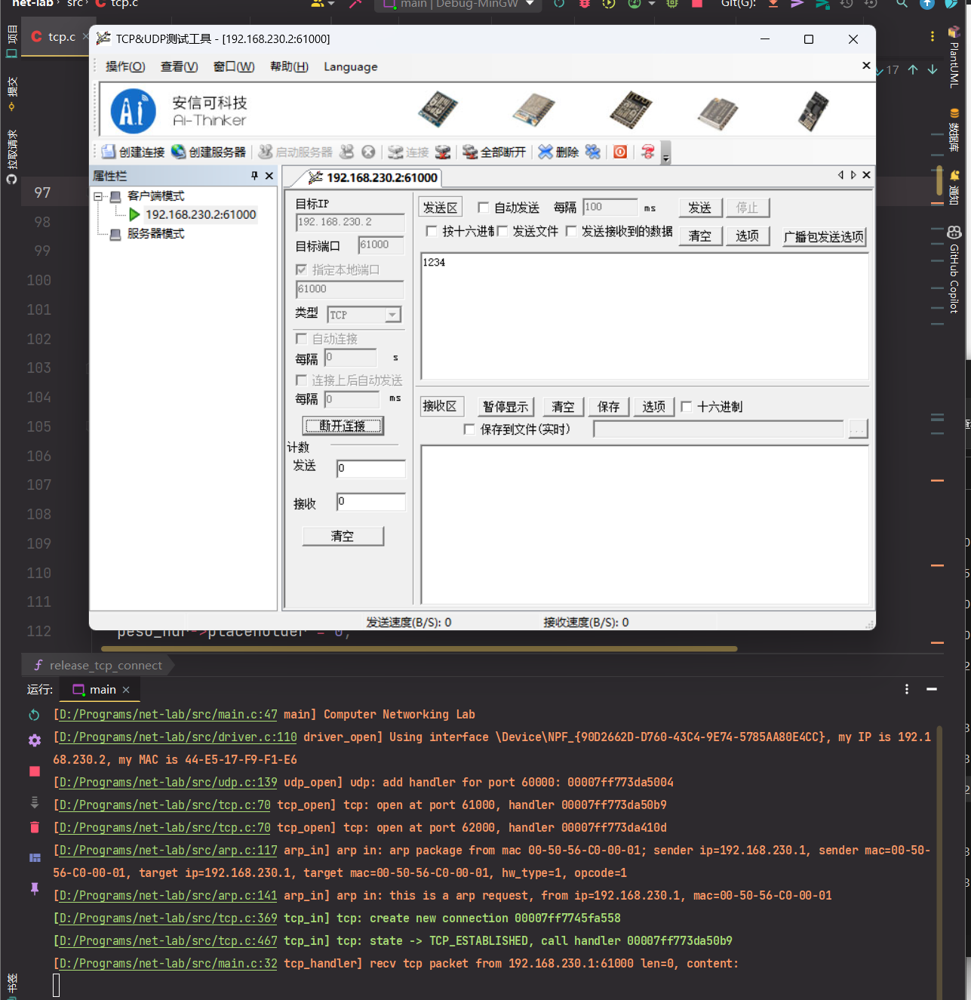
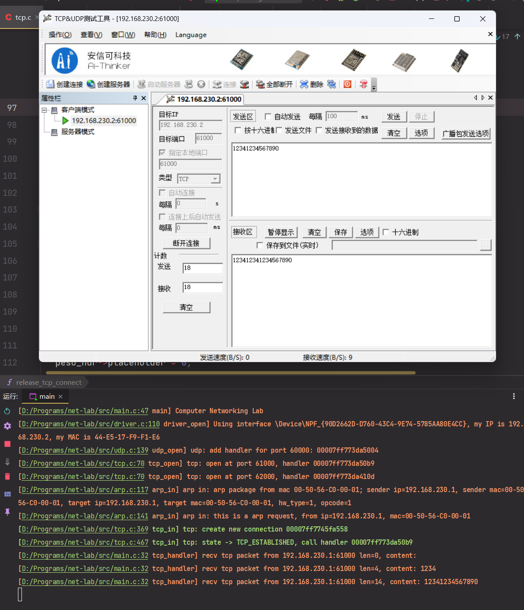
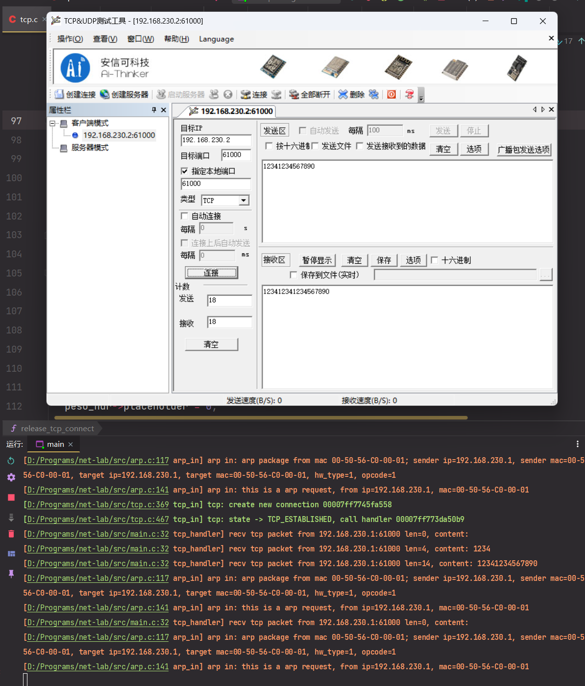

## TCP 实验报告

### 实验详细设计

实验中，依照给出的 TCP 框架实现了 TCP 的收发。详细设计如下：

1. 初始化

   ```c
   /**
    * @brief 初始化tcp在静态区的map
    *        供应用层使用
    *
    */
   void tcp_init() {
     map_init(&tcp_table, sizeof(uint16_t), sizeof(tcp_handler_t), 0, 0, NULL);
     map_init(&connect_table, sizeof(tcp_key_t), sizeof(tcp_connect_t), 0, 0, NULL);
     net_add_protocol(NET_PROTOCOL_TCP, tcp_in);
   }
   ```

   初始化两个 `map`，分别存储 `port <-> handler` 和 `key <-> connect`。

2. TCP 包处理

   1. 大小检查

      ```c
        if (buf->len < sizeof(tcp_hdr_t)) {
          Log("tcp: too short (%zu)", buf->len);
          return;
        }
      ```

   2. checksum 检查

      ```c
        uint16_t checksum_expected = p->chunksum16;
        p->chunksum16 = 0;
        uint16_t checksum_actual = tcp_checksum(buf, src_ip, net_if_ip);
        if (checksum_actual != checksum_expected) {
          Err("tcp: checksum error, expected %x, actual %x", checksum_expected, checksum_actual);
          return;
        }
        p->chunksum16 = checksum_expected;
      ```

   3. 获取信息并根据 `port` 查找 `handler`

      ```c
        uint16_t src_port = swap16(p->src_port16);
        uint16_t dst_port = swap16(p->dst_port16);
        uint32_t got_seq = swap32(p->seq_number32);
        uint32_t got_ack = swap32(p->ack_number32);
        tcp_flags_t flag = p->flags;
        tcp_handler_t *handler = (tcp_handler_t *) map_get(&tcp_table, &dst_port);
        if (!handler) {
          Err("tcp: no handler for port %d", dst_port);
          return;
        }
      ```

   4. 创建 Key，用于存储当前连接 Connection 的索引

      ```c
        tcp_key_t key = new_tcp_key(src_ip, src_port, dst_port);
        Dbg("tcp: KEY = (src=%s, src_port=%d, dst_port=%d)", iptos(key.ip), key.src_port, key.dst_port);
      ```

   5. 查找 `connect_map`，获得当前连接。如果没找到，就创建一个连接，如果找到了就使用已经创建的连接。

      ```c
        tcp_connect_t *connect = (tcp_connect_t *) map_get(&connect_table, &key);
        if (!connect) {
          // connect not found, create a new connect.
          // NOTE that this `connect` is not the same location as the `connect` in the map.
          connect = malloc(sizeof(tcp_connect_t));
          memset(connect, 0, sizeof(tcp_connect_t));
          connect->state = TCP_LISTEN;
          // connect->local_port = dst_port;
          // connect->remote_port = src_port;
          memcpy(connect->ip, src_ip, NET_IP_LEN);
          connect->handler = handler;
          // connect->tx_buf = malloc(sizeof(buf_t));
          // connect->rx_buf = malloc(sizeof(buf_t));
          // buf_init(connect->tx_buf, TCP_BUF_SIZE_TX);
          // buf_init(connect->rx_buf, TCP_BUF_SIZE_RX);
          Assert(map_set(&connect_table, &key, connect) == 0, "Cannot insert connection table!");
          free(connect);
          // update pointer
          connect = (tcp_connect_t *) map_get(&connect_table, &key);
          Ok("tcp: create new connection %p", connect);
        } else {
          Dbg("tcp: using created connection %p", connect);
        }
      ```

   6. 依据连接状态处理连接。如果是 `TCP_LISTEN` 状态

      （1）如果收到的flag带有rst，则close_tcp关闭tcp链接
      （2）如果收到的flag不是syn，则reset_tcp复位通知。因为收到的第一个包必须是syn
      （3）调用init_tcp_connect_rcvd函数，初始化connect，将状态设为TCP_SYN_RCVD
      （4）填充connect字段，包括 local_port、remote_port、ip、unack_seq（设为随机值）、由于是对syn的ack应答包，next_seq与unack_seq一致；ack设为对方的sequence number+1；设置remote_win为对方的窗口大小，注意大小端转换
      （5）调用buf_init初始化txbuf
      （6）调用tcp_send将txbuf发送出去，也就是回复一个tcp_flags_ack_syn（SYN+ACK）报文
      （7）处理结束，返回。
      
      ```c
        if (connect->state == TCP_LISTEN) {
          if (flag.rst) {
            Err("tcp: close when TCP_LISTEN, flag RST recv");
            display_flags(flag);
            tcp_connect_close(connect);
            return;
          }
          if (!flag.syn) {
            Err("tcp: reset when TCP_LISTEN, not a SYN package at first");
            display_flags(flag);
            goto reset_tcp;
          }
          init_tcp_connect_rcvd(connect);
          connect->local_port = dst_port;
          connect->remote_port = src_port;
          memcpy(connect->ip, src_ip, NET_IP_LEN);
          connect->unack_seq = rand() & UINT32_MAX;
          connect->next_seq = connect->unack_seq;
          connect->ack = got_seq + 1;
          connect->remote_win = window_size;
          buf_init(&txbuf, 0);
          tcp_send(&txbuf, connect, tcp_flags_ack_syn);
          return;
        }
      ```
      
   7. 检查 `seq` 和 `ack` ，不一致则发送 `RST` 复位连接

      ```c
        if (got_seq != connect->ack) {
          Err("tcp: reset caused by got_seq(%u) != connect->ack(%u)", got_seq, connect->ack);
          goto reset_tcp;
        }
      ```

   8. *检查**flags**是否有**rst**标志，如果有，则**close_tcp**连接重置*

      ```c
        if (flag.rst) {
          Err("tcp: reset caused by RST flag received");
          tcp_connect_close(connect);
          goto reset_tcp;
        }
      ```

   9. *序号相同时的处理，调用**buf_remove_header**去除头部后剩下的都是数据*

      ```c
      buf_remove_header(buf, sizeof(tcp_hdr_t));
      ```

   10. 状态转换

       ```c
         switch (connect->state) {
           case TCP_LISTEN:
             panic("switch TCP_LISTEN");
             break;
           case TCP_SYN_RCVD:
             if (!flag.ack) {
               // 12、在RCVD状态，如果收到的包没有ack flag，则不做任何处理
               Err("tcp: no ACK flag, ignore");
             } else {
               /*
               13、如果是ack包，需要完成如下功能：
                   （1）将unack_seq +1
                   （2）将状态转成ESTABLISHED
                   （3）调用回调函数，完成三次握手，进入连接状态TCP_CONN_CONNECTED。
               */
               connect->unack_seq++;
               connect->state = TCP_ESTABLISHED;
               Ok("tcp: state -> TCP_ESTABLISHED, call handler %p", *connect->handler);
               (*connect->handler)(connect, TCP_CONN_CONNECTED);
             }
             break;
           case TCP_ESTABLISHED:
             if (!flag.ack && !flag.fin) {
               /*
               14、如果收到的包没有ack且没有fin这两个标志，则不做任何处理
               */
               Err("tcp: when ESTABLISHED, no ACK or FIN flag, ignore");
             } else {
               /*
               15、这里先处理ACK的值，
                   如果是ack包，
                   且unack_seq小于sequence number（说明有部分数据被对端接收确认了，否则可能是之前重发的ack，可以不处理），
                   且next_seq大于sequence number
                   则调用buf_remove_header函数，去掉被对端接收确认的部分数据，并更新unack_seq值
       
               */
               if (flag.ack && connect->unack_seq < got_ack && connect->next_seq > got_ack) {
                 buf_remove_header(connect->tx_buf, got_ack - connect->unack_seq);
                 connect->unack_seq = got_ack;
               } else {
                 Dbg("tcp: when ESTABLISHED, no ACK or ..., ignore :: unack_seq=%u, got_seq=%u, ack=%u, next_seq=%u",
                     connect->unack_seq, got_seq, got_ack, connect->next_seq);
               }
               /*
               16、然后接收数据
                   调用tcp_read_from_buf函数，把buf放入rx_buf中
               */
               uint16_t read_sz = tcp_read_from_buf(connect, buf);
               /*
               17、再然后，根据当前的标志位进一步处理
                   （1）首先调用buf_init初始化txbuf
                   （2）判断是否收到关闭请求（FIN），如果是，将状态改为TCP_LAST_ACK，ack +1，再发送一个ACK + FIN包，并退出，
                       这样就无需进入CLOSE_WAIT，直接等待对方的ACK
                   （3）如果不是FIN，则看看是否有数据，如果有，则发ACK相应，并调用handler回调函数进行处理
                   （4）调用tcp_write_to_buf函数，看看是否有数据需要发送，如果有，同时发数据和ACK
                   （5）没有收到数据，可能对方只发一个ACK，可以不响应
               */
               buf_init(&txbuf, 0);
               if (flag.fin) {
                 connect->state = TCP_LAST_ACK;
                 connect->ack++;
                 tcp_send(&txbuf, connect, tcp_flags_ack_fin);
                 return;
               } else {
                 // if (read_sz > 0) {
                 if (buf->len) {
                   // connect->ack += read_sz;
                   (*connect->handler)(connect, TCP_CONN_DATA_RECV);
                   tcp_write_to_buf(connect, &txbuf);
                   tcp_send(&txbuf, connect, tcp_flags_ack);
                 }
               }
             }
             break;
           case TCP_CLOSE_WAIT:
             panic("switch TCP_CLOSE_WAIT");
             break;
           case TCP_FIN_WAIT_1:
             /*
             18、如果收到FIN && ACK，则close_tcp直接关闭TCP
                 如果只收到ACK，则将状态转为TCP_FIN_WAIT_2
             */
             if (flag.fin && flag.ack) {
               tcp_connect_close(connect);
             } else if (flag.ack) {
               connect->state = TCP_FIN_WAIT_2;
             }
             break;
           case TCP_FIN_WAIT_2:
             /*
             19、如果不是FIN，则不做处理
                 如果是，则将ACK +1，调用buf_init初始化txbuf，调用tcp_send发送一个ACK数据包，再close_tcp关闭TCP
             */
             if (flag.fin) {
               connect->ack++;
               buf_init(&txbuf, 0);
               tcp_send(&txbuf, connect, tcp_flags_ack);
               tcp_connect_close(connect);
             }
             break;
           case TCP_LAST_ACK:
             /*
             20、如果不是ACK，则不做处理
                 如果是，则调用handler函数，进入TCP_CONN_CLOSED状态，，再close_tcp关闭TCP
             */
             if (flag.ack) {
               (*handler)(connect, TCP_CONN_CLOSED);
               tcp_connect_close(connect);
             }
             break;
           default:
             panic("tcp: unknown connect->state %d", connect->state);
             break;
         }
       ```

   11. 在出错时，复位

       ```c
         reset_tcp:
         Err("!!! reset tcp !!!");
         connect->next_seq = 0;
         connect->ack = got_seq + 1;
         buf_init(&txbuf, 0);
         tcp_send(&txbuf, connect, tcp_flags_ack_rst);
         close_tcp:
         release_tcp_connect(connect);
         map_delete(&connect_table, &key);
       ```

3. 发送 TCP 包，`seq_number32 = connect->next_seq - buf->len`，`buf` 里的数据将作为负载，加上 `tcp` 头发送出去。如果 `flags` 包含 `syn` 或 `fin` ，`seq` 会递增。

   ```c
   static void tcp_send(buf_t *buf, tcp_connect_t *connect, tcp_flags_t flags) {
     Dbg("tcp: send sz=%zu, flags=%x", buf->len, *((uint8_t *) &flags));
     // display_flags(flags);
     size_t prev_len = buf->len;
     buf_add_header(buf, sizeof(tcp_hdr_t));
     tcp_hdr_t *hdr = (tcp_hdr_t *) buf->data;
     hdr->src_port16 = swap16(connect->local_port);
     hdr->dst_port16 = swap16(connect->remote_port);
     hdr->seq_number32 = swap32(connect->next_seq - prev_len);
     hdr->ack_number32 = swap32(connect->ack);
     hdr->data_offset = sizeof(tcp_hdr_t) / sizeof(uint32_t);
     hdr->reserved = 0;
     hdr->flags = flags;
     hdr->window_size16 = swap16(connect->remote_win);
     hdr->chunksum16 = 0;
     hdr->urgent_pointer16 = 0;
     hdr->chunksum16 = tcp_checksum(buf, connect->ip, net_if_ip);
     ip_out(buf, connect->ip, NET_PROTOCOL_TCP);
     if (flags.syn || flags.fin) {
       connect->next_seq += 1;
     }
   }
   ```

4. 校验 TCP 包。校验与 UDP 一样需要添加伪头部。

   ```c
   static uint16_t tcp_checksum(buf_t *buf, uint8_t *src_ip, uint8_t *dst_ip) {
     uint16_t len = (uint16_t) buf->len;
     tcp_peso_hdr_t *peso_hdr = (tcp_peso_hdr_t *) (buf->data - sizeof(tcp_peso_hdr_t));
     tcp_peso_hdr_t pre; //暂存被覆盖的IP头
     memcpy(&pre, peso_hdr, sizeof(tcp_peso_hdr_t));
     memcpy(peso_hdr->src_ip, src_ip, NET_IP_LEN);
     memcpy(peso_hdr->dst_ip, dst_ip, NET_IP_LEN);
     peso_hdr->placeholder = 0;
     peso_hdr->protocol = NET_PROTOCOL_TCP;
     peso_hdr->total_len16 = swap16(len);
     uint16_t checksum = checksum16((uint16_t *) peso_hdr, len + sizeof(tcp_peso_hdr_t));
     memcpy(peso_hdr, &pre, sizeof(tcp_peso_hdr_t));
     return checksum;
   }
   ```

### 实验结果

建立连接



发送两次数据



断开连接



### 存在的问题

框架中没有处理丢包和重发，所以在出现丢包的时候很可能会卡住。